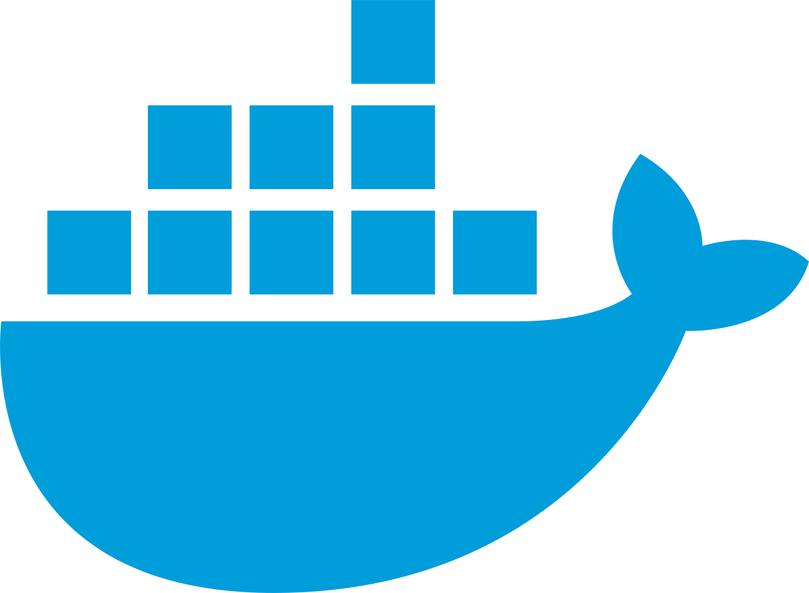

## Hi there, I'm Keane 👋 💻

## I'm a Computer Science undergraduate in NUS!

- 👯 &nbsp;&nbsp; I enjoy working with Java, Spring Boot, PostgreSQL and gRPC
- 🔭 &nbsp;&nbsp; I’m currently a Software Engineer Intern at [Wise](https://wise.com/)

## Languages & Technologies

  
  &nbsp;
  
  
  
  &nbsp;
  
  &nbsp;
  
  &nbsp;
  
  &nbsp;
  
  &nbsp;
  
  &nbsp;
  
  &nbsp;
  
  &nbsp;  

## Get to know more about me at

* [My personal website](https://keanecjy.github.io/me/)
* [LinkedIn](https://www.linkedin.com/in/keanecjy/)

---

  
:zap: GitHub stats

    

    

